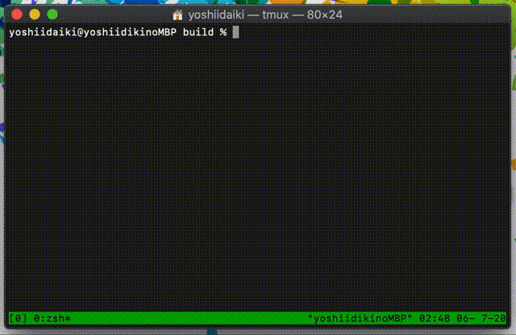

# Fourier CUI
  
大学3年生の頃に作ったプログラムです。  
CUIでマイクのDFT波形が見れます。  

# Build & Run
```
$ git clone https://github.com/wakewakame/fourier_cui
$ cd fourier_cui
$ git submodule update --init --recursive
$ mkdir build && cd build
$ cmake ..
$ make
$ ./fourier
```
